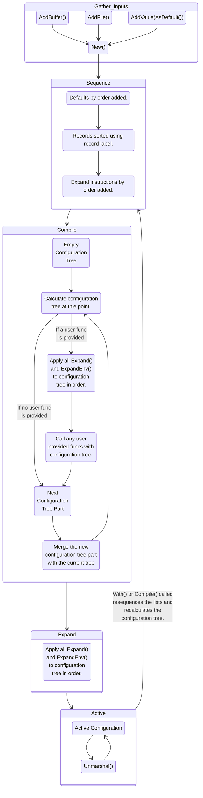

<!--
SPDX-FileCopyrightText: 2022 Weston Schmidt <weston_schmidt@alumni.purdue.edu>
SPDX-License-Identifier: Apache-2.0
-->
# goschtalt
A simple configuration library that supports multiple files and formats.

## Goals & Themes

* Support multiple configuration files and sources.
* Enable tracing the origin of a configuration value.
* Favor user customization options over building everything in.
* Keep dependencies to a minimum.

## API Stability

This package has not yet released to 1.x yet, so APIs are subject to change for
a bit longer.

## Compilation of a Configuration

## Extensions

These are just the extensions the goschtalt team maintains.  Others may be available
and it's fairly easy to write your own.  Extensions have their own go.mod files
that independently track dependencies to keep dependencies only based on what
you need, not what could be used.

### Configuration Decoders

The decoders convert a file format into a useful object tree.  The meta.Object has
many convenience functions that make adding decoders pretty simple.  Generally,
the hardest part is determining where you are processing in the original file.

| Status | GoDoc | Extension | Description |
|--------|-------|-----------|-------------|
|  |  | n/a | An environment variable based configuration decoder. |
|  |  | `.json` | A JSON configuration decoder. |
|  |  | `.properties` | A properties configuration decoder. |
|  |  | `.yaml`, `.yml` | A YAML/YML configuration decoder |

### Configuration Encoders

The encoders are used to output configuration into a file format.  Ideally you want
a format that accepts comments so it's easier see where the configurations originated
from.

| Status | GoDoc | Extension | Description |
|--------|-------|-----------|-------------|
|  |  | `.yaml`, `.yml` | A YAML/YML configuration encoder. |

## Dependencies

There are only two production dependencies in the core goschtalt code beyond the
go standard library.  The rest are testing dependencies.

Production dependencies:

* [github.com/mitchellh/hashstructure](https://github.com/mitchellh/hashstructure)
* [github.com/mitchellh/mapstructure](https://github.com/mitchellh/mapstructure)

## Examples

Coming soon.
